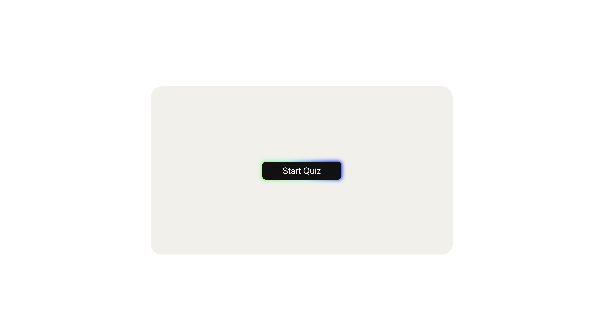
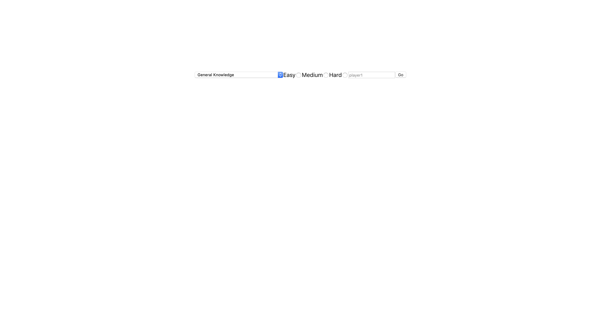

# Second Project Week - React TDD Quiz

View project here: https://react-tdd-quiz.herokuapp.com/ 

This is a quiz application that enables users to test their knowledge in over 15 different topics.

## Contributors 

- [Brian Musonza](https://github.com/chipembere)
- [Harry Pendered Mazer](https://github.com/harry-pm)
- [Jade Suzarte](https://github.com/jadesuzarte)
- [Yusaf Osei-Bonsu](https://github.com/YusafOsei-Bonsu)

## Technologies Used
- React 
- Redux 
- Enzyme
- Jest
- CSS
- Bootstrap

## User stories

- As a user, I would like a quiz game to test and improve my knowledge.

- As a user, I would like a question with multiple choice answer so I can answer it.

- As a user, I would like to know the results so I can verify my knowledge.

- As a user, I would like to choose a topic so I can answer question on a specific category.

- As a user, I would like to choose level of difficulty so I can match the questions with my knowledge.

- As a user, I would like the option to play multiple times so that I can enjoy myself while I improve my knowledge

## Daily Plan

- Stand-Ups in the kitchen each morning.
- Working using the driver navigator style for 30 minute intervals and each our hour we rest for 5-10min each hour or two.
- Retros at the end of the day at 17:00 or 17:30.
- Review and comment pull requests.

### Monday Retro

Team 1: Harry and Yusaf
- Made all the containers and components using mock data
	
Team 2: Brian and Jade 
- Made a store which is available to all elements
- Prepared fetch functionality.
- Saved Fetched data to store.

### Tuesday Retro

Team 1: Yusaf and Jade  
- Styled ‘start’ page.
- Wrote basic tests. 
	
Team 2: Brian and Harry
- Created routing paths for all containers.
- User has access to quiz.

## Wednesday Retro

Team 1: Brian and Yusaf worked on:
- Stopping quiz at length of array -1.
- Logic for updating the score.
- MVP by end of day.

Team 2: Harry and Jade worked on:
- Testing. Solved the merge issue and wrote more test.
- Started mocking the store.
- Added Jest dependencies.

## Thursday Retro 
The entire team worked together on testing

## Friday Retro 
Jade: 
- Finalising ReadMe file.
- PowerPoint presentation.

Harry:
- Tests then work on presentation.

Yusaf:
- Styling.
- Roaming.

Brian:
- Testing.
- Roaming.

## Blockers/Resolutions

### Deploying React Quiz to Heroku

We struggled to deploy the React Quiz onto the Heroku Cloud Platform. Fortunately, we have discovered a way to do so.
  1. We created an Express app (`server.js`) file (in the root directory) which serves a single route...
      ```javascript
      const express = require('express');
      // eslint-disable-next-line no-unused-vars
      const bodyParser = require('body-parser');
      const path = require('path');
      const app = express();
      const port = process.env.PORT || 8080;
      app.use(express.static(path.join(__dirname, "build")));

      // This route serves the react app`
      app.get('/', (req, res) => res.sendFile(path.resolve(__dirname, "build", "index.html")));

      app.listen(port, () => console.log(``Server listening on port ${port}``));
      ```

      - Optionally, you can test if the server runs the React application by entering `node server.js` or `nodemon server.js` in the terminal.

  2. In `package.json`, we wrote the following properties...
     - `"engines": { "npm": "6.14.1", "node": "12.13.0" }`.
     - `"main": "server.js"`.
     - In the `Scripts` object, we added the following property: `"heroku-postbuild": "npm install"` and set the `start` script to `"node server.js"`.

  3. Created a file called `Procfile` (in the root directory) with one line: `web: node server.js`.

  4. Entered `npm run build` in the terminal and removed `/build` from `.gitignore` by commenting it out.

  5. Committed steps 1-4 to GitHub and Heroku repository.

As a guide, we used the following website: [How to Deploy Your React App to Heroku](https://medium.com/better-programming/how-to-deploy-your-react-app-to-heroku-aedc28b218ae).

## Our Mvp
Start page


Form page


Quiz page


Results page

