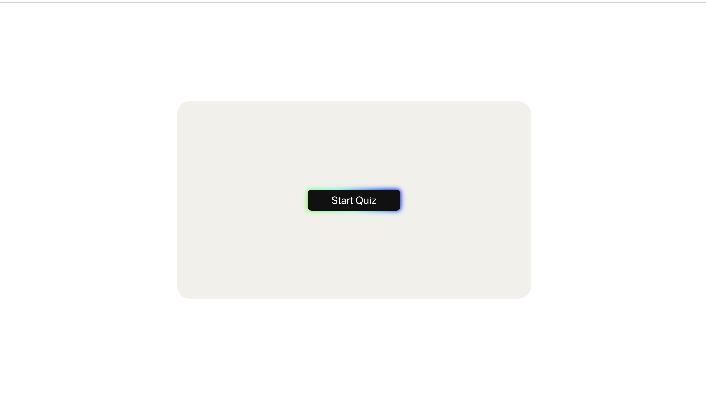
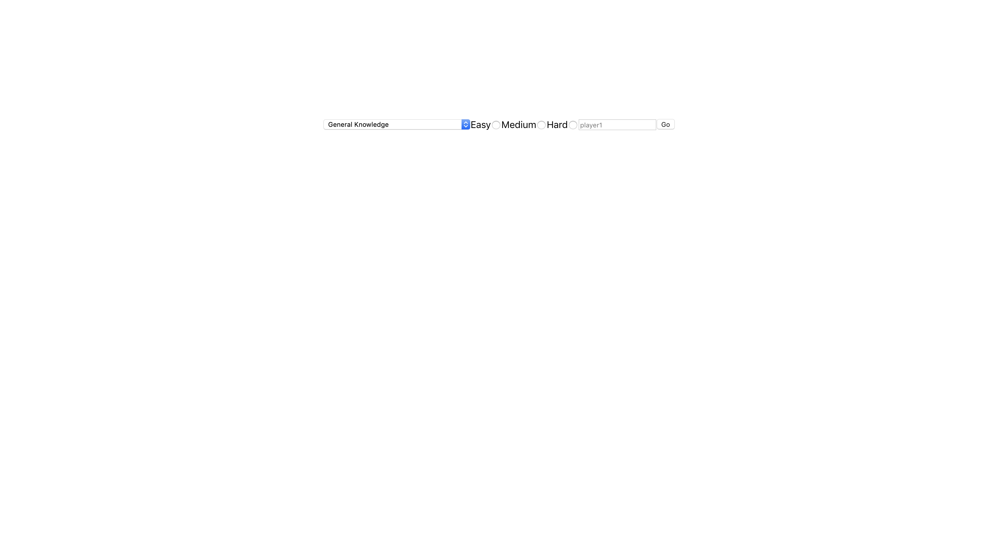

README
======

## The Project 

This is a quiz application that enables users to test their knowledge in over 15 different topics.

## Technologies Used
♣	React   
♣	Redux  
♣	Enzyme  
♣	Jest 
♣	CSS  
♣	Bootstrap 

## Contributors 

♣	Brian Musonza @chipembere 
♣	Harry Pendered Mazer @harry-pm 
♣	Jade Suzarte @jadesuzarte  
♣   Yusaf Osei-Bonsu @YusafOsei-Bonsu

## Daily Plan

Stand-Ups in the kitchen each morning.
Working using the driver navigator style for 30 minute intervals and each our hour we rest  for 5-10min each hour or two.
Retros at the end of the day at 17:00 or 17:30.
Review and comment pull requests.

### Monday Retro

Team 1: Harry and Yusaf

•	Made all the containers and components using mock data
	
Team 2: Brian and Jade  
•	Made a store which is available to all elements 
•	Prepared fetch functionality. 
•	Saved Fetched data to store.

### Tuesday Retro

Team 1: Yusaf and Jade  
•	Styled ‘start’ page. 
•	Wrote basic tests.  
	
Team 2: Brian and Harry 
•	Created routing paths for all containers. 
•	User has access to quiz.  

## Wednesday Retro

Team 1: Brian and Yusaf  
	Worked on:  
•	Stopping quiz at length of array -1.  
•	Logic for updating the score.  
•	Mvp by end of day.  
Team 2: Harry and Jade 
	Worked on:  
•	Testing. Solved the merge issue and wrote more test. 
•   Started mocking the store. 
•	Added Jest dependencies.

## Thursday Retro 
The entire team worked together on testing

## Friday Retro 
Jade:  
	Finalising ReadMe file.	 
	Power Point 
		

Harry:  
	Tests then work on presentation. 

Yusaf:  
	Styling 
	Roaming 

Brian:  
	Testing 
	Roaming 

## User stories

1)	As a user
	I would like a quiz game
	To test and improve my knowledge

2) As a user
	I would like a question with multiple choice answer
	So I can answer it

3) As a user
	I would like to know the results
	So I can verify my knowledge

4) As a user 
	I would like to choose a topic
	So I can answer question on a specific category

5) As a user
	I would like to choose level of difficulty
	So I can match the questions with my knowledge

6) As a user
	I would like the option to play multiple times
	So that I can enjoy myself while I improve my knowledge

	## Our Mvp
	
Start page 
	
	Form page
	
	Quiz page
	
	Results page
